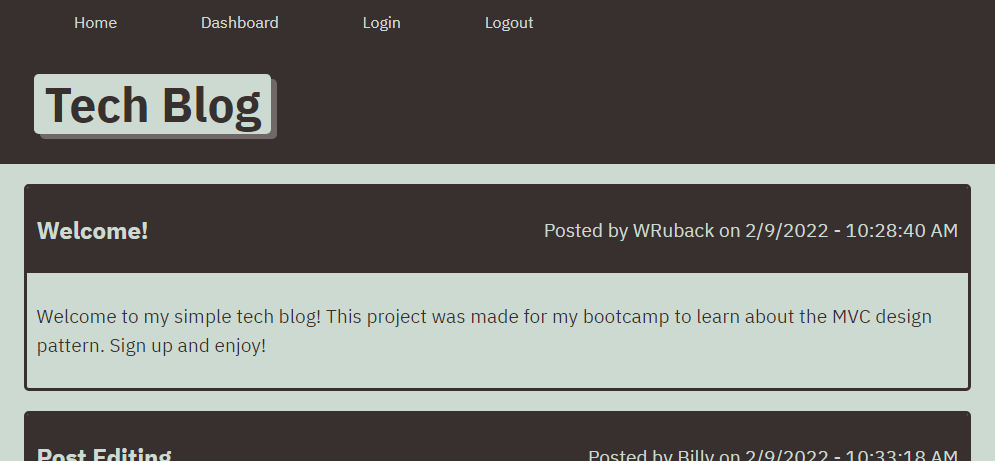
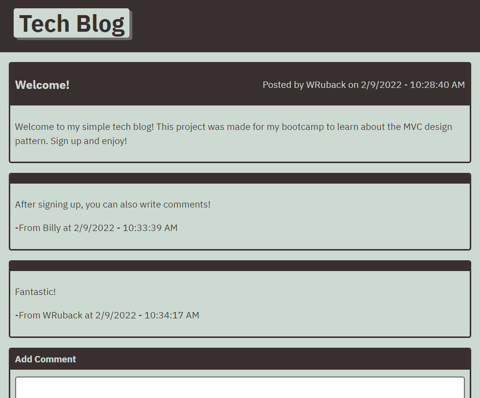
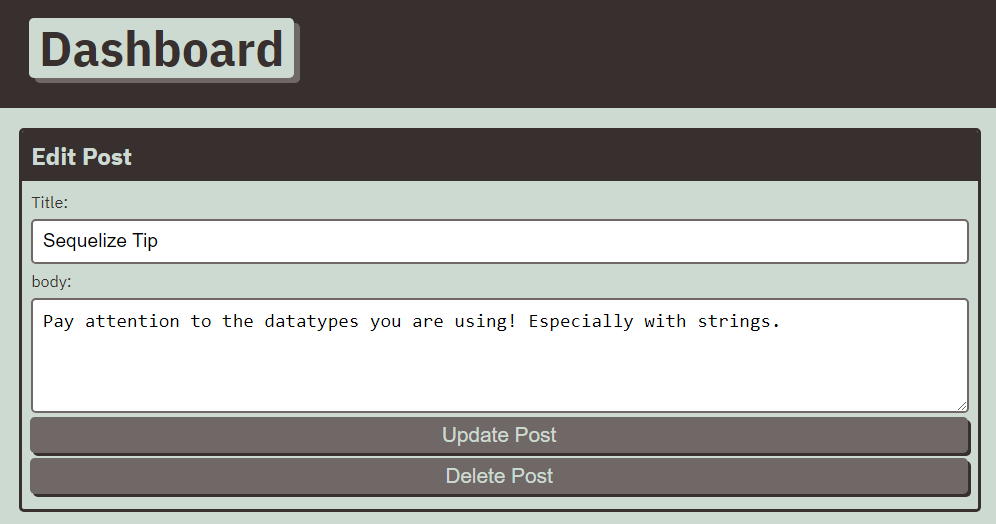
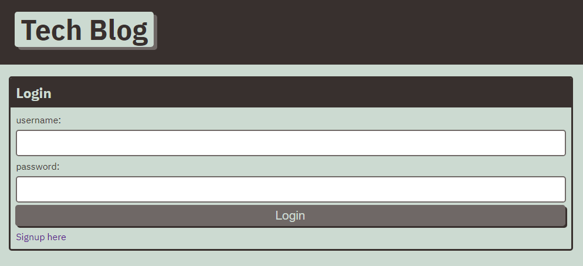

# Simple Tech Blog

## Table of Contents

- [Simple Tech Blog](#simple-tech-blog)
  - [Table of Contents](#table-of-contents)
  - [Description](#description)
  - [Deployment](#deployment)
  - [Installation](#installation)
  - [Usage](#usage)
  - [Contributing](#contributing)
  - [Tests](#tests)
  - [License](#license)
  - [Questions](#questions)
  - [Screenshots](#screenshots)

## Description

A project for my bootcamp to create a simple tech blog framework that is based on the MVC design pattern. The site lets users sign up, make blog posts, edit them, and comment on there own or other's posts. All of the blog posts and user information are saved using a MYSQL database, and interacted with by sequelize. The user's login information is also saved via sessions and cookies.

## Deployment

[See the Heroku deployment of this project here.](https://wr-tech-blog.herokuapp.com/)

## Installation

You set up the tech blog, download the reposity. Then, in the terminal, pointing at the directory, run `npm install` to get all the needed packages.

Next, you need to setup your database. With MYSQL installed, run `mysql -u yourusername -p`, and then enter your password. Once in the MYSQL shell, run the command `source db/schema.sql`, and then once it runs successfully, exit with the command `exit`.

Next, setup a `.env` file, with your MYSQL username, password, and database. format like the example below, and save it in the main directory.

>DB_NAME=tech_blog_db
>
>DB_USER=yourUsername
>
>DB_PW=yourPassword

Then, run the command `npm start`, and your website will be running on your localhost!

## Usage

Once on the site, you must login to make a post. Click on login, and enter your information if you already have it. If not, click on signup in the lower corner, then enter the username and password you want. 

Once signed in, you can go to the dashboard, and create a new post by entering in the title and body information. 

If you want to comment on another blog post, click on the blog, and while logged in, enter your comment in the text box below.

## Contributing

Anyone can fork this project and add features. However, all changes to the main section must be approved by the Admin.

## Tests

There are no testing procedures for this project.

## License

This project is licensed under a [MIT license](https://opensource.org/licenses/MIT).

## Questions

If you have any questions, please send them to [WRuback](https://github.com/WRuback) at wrubackdev@gmail.com with the heading "Simple Tech Blog Question".

## Screenshots

